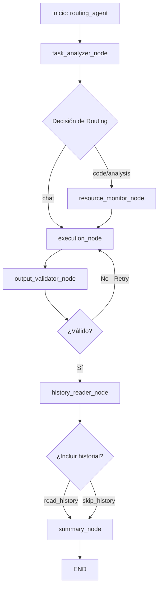

# ARCHITECTURE.md - AI-Agent-Lab

Este documento proporciona una descripción exhaustiva de la arquitectura del laboratorio de agentes LLM (entorno MGP). El sistema está diseñado para orquestar múltiples modelos de lenguaje grandes utilizando herramientas como LangChain, LangGraph y modelos locales, con capacidades avanzadas de routing, validación automática, estrategias de carga optimizadas, métricas comparativas y herramientas de diagnóstico integral.

---

## 🎯 Propósito y Objetivos

El AI-Agent-Lab es un entorno experimental para:
- Orquestación inteligente de múltiples LLMs locales
- Experimentación con estrategias de carga y optimización de memoria
- Implementación de flujos multi-agente con routing condicional
- Comparación sistemática de rendimiento entre modelos
- Desarrollo de agentes especializados con herramientas personalizadas

---

## 🏗️ Arquitectura General

### Componentes Principales

```
AI-Agent-Lab/
├── main.py                          # Punto de entrada principal
├── config.py                        # Configuración centralizada
├── fix_hanging_model.py            # Utilidad de recuperación de emergencia
│
├── local_models/                    # Gestión de modelos locales
│   ├── llm_launcher.py             # Lanzador modular de modelos
│   └── loading_strategies.py       # Estrategias de carga especializadas
│
├── langchain_integration/          # Integración con LangChain/LangGraph
│   ├── langgraph/                  # Implementación de grafos de agentes
│   │   ├── routing_agent.py        # Agente principal con routing
│   │   ├── llm_graph.py           # Construcción de grafos
│   │   ├── local_llm_node.py      # Bridge para modelos locales
│   │   ├── validators.py          # Validación de outputs
│   │   └── nodes/                 # Nodos especializados del grafo
│   │
│   ├── memory/                     # Gestión de memoria y caché
│   │   └── local_llm_manager.py   # Manager centralizado de modelos
│   │
│   ├── tools/                      # Herramientas para agentes
│   │   ├── lab_tools.py           # Herramientas del laboratorio
│   │   └── history_tools.py       # Herramientas de historial
│   │
│   └── wrappers/                   # Wrappers de modelos
│       ├── local_model_wrapper.py  # Wrapper principal LangChain
│       └── hf_pipeline_wrappers/   # Wrappers específicos de HuggingFace
│
├── workers/                        # Procesos de trabajo
│   └── metrics_analyzer.py        # Análisis comparativo de métricas
│
├── utils/                          # Utilidades generales
│   ├── gpu_guard.py               # Gestión y monitoreo de GPU
│   ├── atomic_write.py            # Escritura atómica de archivos
│   ├── logger.py                  # Sistema de logging estructurado
│   └── logger_decorator.py        # Decoradores de logging
│
└── tests/                          # Suite de pruebas
    ├── debugger_agent.py          # Agente AutoGen para debugging
    └── langgraph/                 # Tests de componentes LangGraph
```

---

## 🔁 Modos de Ejecución

### 1. **Modo Manual - CLI Interactiva**

**Archivo principal:** `main.py`

Características:
- Menú interactivo para selección de modelos y estrategias
- Ejecución directa con parámetros de línea de comandos
- Validación automática de VRAM antes de cargar modelos
- Sistema de logging estructurado en JSON
- Limpieza automática de memoria GPU post-ejecución

**Flujo de ejecución:**
1. Inicialización del entorno y validación de configuración
2. Detección de modelos disponibles
3. Selección interactiva o automática de modelo/estrategia
4. Carga del modelo según estrategia seleccionada
5. Procesamiento del prompt
6. Almacenamiento de métricas y outputs
7. Limpieza de recursos

### 2. **Modo Automático - Routing con LangGraph**

**Archivo principal:** `langchain_integration/langgraph/routing_agent.py`

Características:
- Flujo dinámico basado en grafos de estado
- Routing condicional inteligente
- Recuperación automática ante errores
- Validación y reintentos automáticos
- Análisis automático del tipo de tarea

**Arquitectura del Grafo:**



---

## 📦 Componentes Detallados

### 🔹 **main.py** - Punto de Entrada Principal

**Responsabilidades:**
- Parseo de argumentos CLI
- Inicialización del entorno
- Coordinación entre modo manual y automático
- Gestión del ciclo de vida de la aplicación

**Funciones clave:**
- `main()`: Orquesta el flujo principal
- `parse_arguments()`: Procesa argumentos CLI
- `interactive_menu()`: Presenta menú interactivo
- `execute_model()`: Coordina ejecución con ModelLauncher

**Integraciones:**
- `config.py` para configuración
- `local_models/llm_launcher.py` para ejecución
- `utils/gpu_guard.py` para validación de recursos

### 🔹 **config.py** - Configuración Centralizada

**Características:**
- Carga de variables desde `.env`
- Validación automática de configuración
- Valores por defecto seguros

**Variables gestionadas:**
```python
- OPENAI_API_KEY
- ANTHROPIC_API_KEY
- DEFAULT_MODEL
- DEFAULT_TEMPERATURE
- MAX_TOKENS
- LOG_LEVEL
```

**Métodos principales:**
- `load_config()`: Carga configuración desde entorno
- `validate()`: Valida integridad de configuración
- `get_model_config()`: Retorna configuración específica por modelo

### 🔹 **local_models/llm_launcher.py** - Lanzador Modular

**Arquitectura:**
```python
class ModelLauncher:
    def __init__(self, model_key: str, strategy: str)
    def launch(prompt: str, max_tokens: int, device_map: str) -> str
    def get_metrics() -> Dict[str, Any]
```

**Modelos soportados:**
```python
MODELS = {
    "llama3": "meta-llama/Meta-Llama-3-8B-Instruct",
    "mistral7b": "mistralai/Mistral-7B-Instruct-v0.2",
    "deepseek7b": "deepseek-ai/deepseek-llm-7b-chat",
    "deepseek-coder-6.7b": "deepseek-ai/deepseek-coder-6.7b-instruct"
}
```

**Características:**
- Logging estructurado por sesión
- Métricas detalladas de inferencia
- Persistencia automática de outputs
- Compatibilidad con `launch_model()` legacy

### 🔹 **local_models/loading_strategies.py** - Estrategias de Carga

**Estrategias implementadas:**

1. **StandardLoadingStrategy**
   - Carga directa sin optimizaciones
   - Máximo rendimiento con alta demanda de VRAM
   - Ideal para GPUs con >16GB VRAM

2. **OptimizedLoadingStrategy**
   - Cuantización 4-bit con BitsAndBytes
   - Reduce uso de VRAM en ~75%
   - Balance entre rendimiento y recursos
   - Configuración:
     ```python
     BitsAndBytesConfig(
         load_in_4bit=True,
         bnb_4bit_use_double_quant=True,
         bnb_4bit_quant_type="nf4",
         bnb_4bit_compute_dtype="bfloat16"
     )
     ```

3. **StreamingLoadingStrategy**
   - Generación en tiempo real con TextStreamer
   - Feedback inmediato al usuario
   - Threading para generación no bloqueante

**Placeholders para futuras estrategias:**
- `FastLoadingStrategy`: Carga acelerada con técnicas avanzadas
- `CPULoadingStrategy`: Inferencia en CPU para sistemas sin GPU

### 🔹 **langchain_integration/langgraph/routing_agent.py** - Orquestador Principal

**Estado del Grafo (AgentState):**
```python
class AgentState(TypedDict):
    input: str              # Prompt del usuario
    output: str             # Respuesta generada
    task_type: str          # Tipo de tarea detectada
    selected_model: str     # Modelo seleccionado
    strategy: str           # Estrategia de carga
    vram_status: str        # Estado de VRAM
    should_optimize: bool   # Flag de optimización
    messages: List[str]     # Log de mensajes del proceso
    analysis_result: str    # Resultado del análisis
    final_summary: str      # Resumen final
    retry_count: int        # Contador de reintentos
    retry: bool            # Flag de reintento
    last_output: str       # Último output del historial
```

**Funciones de routing condicional:**
- `route_after_analysis()`: Decide si monitorear recursos
- `route_after_validation()`: Decide si reintentar o continuar
- `should_include_history()`: Decide si leer historial

### 🔹 **langchain_integration/langgraph/nodes/** - Nodos Especializados

#### **task_analyzer_node.py**
- Analiza el prompt para detectar tipo de tarea
- Categorías: `code`, `technical`, `creative`, `analysis`, `chat`
- Utiliza `ModelSelectorTool` para recomendar modelo
- Lógica basada en palabras clave y contexto

#### **resource_monitor_node.py**
- Monitorea VRAM disponible vía `VRAMMonitorTool`
- Decide estrategia óptima según recursos
- Umbrales configurables (default: 5GB para estrategia standard)
- Logging detallado de decisiones

#### **execution_node.py**
- Ejecuta el modelo seleccionado con la estrategia elegida
- Maneja errores y excepciones gracefully
- Integración con `local_llm_node` para ejecución
- Métricas de caracteres generados

#### **output_validator_node.py**
- Valida calidad del output generado
- Criterios de validación:
  - Longitud mínima (50 caracteres)
  - Ausencia de errores/excepciones
  - Coherencia básica
- Sistema de reintentos con límite (`MAX_RETRIES = 1`)

#### **history_reader_node.py**
- Lee outputs anteriores desde `outputs/`
- Ordenamiento por fecha de modificación
- Manejo robusto de errores de lectura
- Integración opcional en el flujo

#### **summary_node.py**
- Genera resumen estructurado del proceso
- Incluye: tarea, modelo, estrategia, longitud, VRAM
- Formato compacto para logging

### 🔹 **langchain_integration/memory/local_llm_manager.py** - Gestión de Memoria

**Características:**
- Cache centralizado de wrappers de modelos
- Reutilización eficiente de modelos cargados
- Gestión automática del ciclo de vida
- Limpieza explícita de recursos

**API principal:**
```python
class LocalLLMManager:
    def get_llm(model_key: str, strategy: str, **kwargs) -> LocalModelWrapper
    def clear_cache()
    def list_cached_models() -> list
```

### 🔹 **langchain_integration/wrappers/local_model_wrapper.py** - Wrapper LangChain

**Características principales:**
- Hereda de `langchain_core.language_models.llms.LLM`
- Compatible con toda la infraestructura LangChain
- Soporta ambos modos: ModelLauncher y carga directa
- Métricas detalladas por sesión

**Campos configurables:**
```python
model_key: str          # Clave del modelo
strategy: str           # Estrategia de carga
max_tokens: int         # Máximo de tokens
temperature: float      # Temperatura de sampling
top_p: float           # Top-p sampling
device_map: str        # Mapeo de dispositivos
```

**Métodos principales:**
- `_call()`: Generación síncrona (requerido por LangChain)
- `_stream()`: Generación en streaming
- `clear_model_cache()`: Limpieza de recursos
- `get_metrics()`: Obtención de métricas acumuladas

### 🔹 **langchain_integration/tools/** - Herramientas para Agentes

#### **lab_tools.py**
1. **VRAMMonitorTool**
   - Monitorea memoria GPU en tiempo real
   - Retorna: VRAM libre, usada, total
   - Formato legible para humanos

2. **ModelSelectorTool**
   - Recomienda modelo según contexto
   - Análisis de complejidad del prompt
   - Consideración de recursos disponibles

3. **FileSearchTool**
   - Búsqueda de archivos en el proyecto
   - Filtrado por extensión y contenido
   - Útil para contexto adicional

#### **history_tools.py**
- **HistoryReaderNode**
  - Carga outputs históricos
  - Parsing de metadatos
  - Integración con el estado del grafo

### 🔹 **utils/** - Utilidades del Sistema

#### **gpu_guard.py**
```python
def get_gpu_info() -> Dict[str, float]
def check_vram_availability(required_gb: float) -> bool
def clear_gpu_memory()
def get_compute_capability() -> float
```

#### **logger.py**
- Sistema de logging estructurado en JSON
- Logs por sesión y modelo
- Clase `LogAnalyzer` para análisis post-hoc
- Rotación automática de logs

#### **atomic_write.py**
- Escritura segura con archivos temporales
- Prevención de corrupción de datos
- Soporte para JSON y texto plano

### 🔹 **workers/metrics_analyzer.py** - Análisis Comparativo

**Funcionalidades:**
- Comparación entre múltiples modelos
- Métricas de rendimiento (tiempo, tokens/seg)
- Análisis de similitud entre outputs
- Generación de reportes CSV

**Métricas calculadas:**
- Tiempo promedio de inferencia
- Tokens por segundo
- Uso de memoria por modelo
- Similitud coseno entre outputs

### 🔹 **fix_hanging_model.py** - Recuperación de Emergencia

**Módulos incluidos:**
1. **Monitor de Recursos**
   - CPU, RAM, GPU, Disco
   - Detección de cuellos de botella

2. **Explorador de Caché**
   - Análisis de caché de HuggingFace
   - Limpieza selectiva

3. **Matador de Procesos**
   - Identificación de procesos Python colgados
   - Terminación segura

4. **Prueba de Generación Mínima**
   - Test con configuración minimal
   - Diagnóstico de problemas

5. **Recomendaciones Automáticas**
   - Análisis de problemas detectados
   - Sugerencias de solución

---

## 🧪 Tests y Validación

### Tests Unitarios (pytest)

**langgraph/**
- `test_end_to_end_graph.py`: Validación de construcción del grafo
- `test_history_reader_node.py`: Comportamiento sin historial
- `test_output_validator_node.py`: Detección de errores y retry
- `test_task_analyzer_node.py`: Clasificación de tareas

### Test de Integración

**debugger_agent.py**
- Agente AutoGen para debugging interactivo
- Análisis automático de errores Python
- Sugerencias de corrección

---

## 📊 Flujos de Datos

### Flujo de Ejecución Manual
```
Usuario → main.py → ModelLauncher → LoadingStrategy → HF Model → Output
                 ↓                                              ↓
              Logging ← Metrics ← GPU Monitor ← ← ← ← ← ← ← ← ↓
```

### Flujo de Ejecución Automática (LangGraph)
```
Usuario → routing_agent → task_analyzer → route_decision
                                              ↓
                                     resource_monitor
                                              ↓
                                      execution_node
                                              ↓
                                    output_validator
                                         ↓        ↑
                                    [retry?] ← ← ←
                                         ↓
                                   history_reader
                                         ↓
                                    summary_node → Output
```

---

## 🔐 Consideraciones de Seguridad y Rendimiento

### Gestión de Memoria
- Limpieza automática post-ejecución
- Monitoreo continuo de VRAM
- Estrategias de carga adaptativas
- Cache inteligente de modelos

### Manejo de Errores
- Try-catch exhaustivos en puntos críticos
- Logging detallado de excepciones
- Recuperación automática cuando es posible
- Scripts de emergencia para casos extremos

### Optimizaciones
- Cuantización 4-bit para modelos grandes
- Streaming para feedback inmediato
- Reutilización de modelos cargados
- Escritura atómica para prevenir corrupción

---

## 🚀 Guía de Uso Rápido

### Ejecución Manual Básica
```bash
# Menú interactivo
python main.py

# Ejecución directa
python main.py --model mistral7b --strategy optimized --prompt "Explica qué es Python"
```

### Ejecución con LangGraph
```bash
# Pipeline automático completo
python langchain_integration/langgraph/routing_agent.py

# Con prompt específico
python langchain_integration/langgraph/routing_agent.py --prompt "Escribe una función fibonacci"
```

### Diagnóstico de Problemas
```bash
# Si un modelo se cuelga
python fix_hanging_model.py

# Análisis de métricas
python workers/metrics_analyzer.py
```

---

## 🔄 Ciclo de Vida de una Solicitud

1. **Recepción**: El usuario envía un prompt
2. **Análisis**: Se determina el tipo de tarea
3. **Selección**: Se elige modelo y estrategia óptimos
4. **Validación**: Se verifican recursos disponibles
5. **Carga**: Se inicializa el modelo con la estrategia
6. **Generación**: Se procesa el prompt
7. **Validación**: Se verifica la calidad del output
8. **Persistencia**: Se guardan métricas y resultados
9. **Limpieza**: Se liberan recursos
10. **Respuesta**: Se retorna el resultado al usuario

---

## 🎯 Roadmap y Extensibilidad

### Implementado
- ✅ Soporte multi-modelo local
- ✅ Estrategias de carga optimizadas
- ✅ Routing inteligente con LangGraph
- ✅ Sistema de métricas y logging
- ✅ Validación y reintentos automáticos

### En Desarrollo
- 🚧 FastLoadingStrategy para carga acelerada
- 🚧 CPULoadingStrategy para sistemas sin GPU
- 🚧 Soporte para modelos en la nube
- 🚧 UI web para monitoreo en tiempo real

### Futuro
- 📋 Orquestación multi-GPU
- 📋 Fine-tuning automático
- 📋 Agentes especializados por dominio
- 📋 Sistema de plugins extensible

---

## 📝 Notas de Mantenimiento

- Mantener sincronizados los README.md de cada módulo
- Actualizar este documento con cada cambio arquitectural significativo
- Documentar decisiones de diseño en los PRs correspondientes
- Seguir convenciones de código establecidas en `.editorconfig`

---

> *Última actualización: [Fecha actual]*
> *Versión: 2.0.0*
> *Mantenedor: AI-Agent-Lab Team*