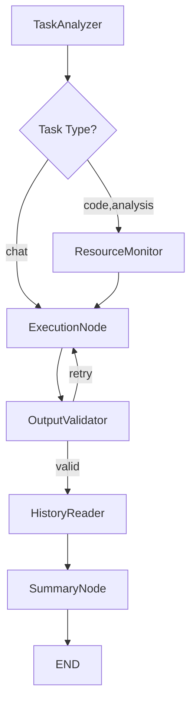
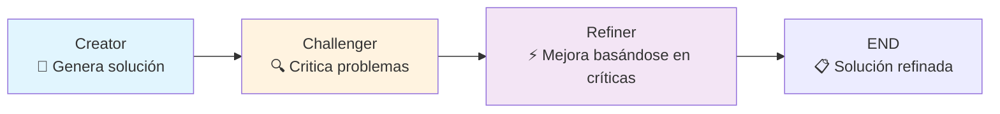
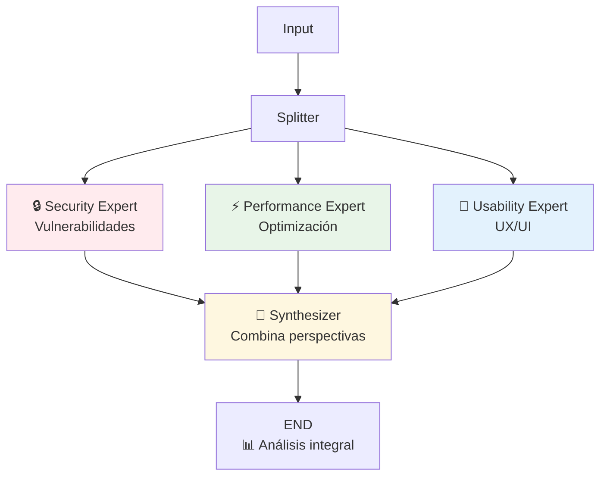

# 🔄 FLOWS CATALOG - AI Agent Lab V3

> **Guía visual:** Catálogo completo de flujos de orquestación disponibles

---

## 🎯 OVERVIEW DE FLUJOS

| Flujo | Estado | Uso Principal | Complejidad | Tiempo Típico |
|-------|--------|---------------|-------------|---------------|
| **Linear** | ✅ Estable | Inferencia tradicional | Baja | ~30-60s |
| **Challenge** | ✅ Probado | LLM Deliberation, crítica automática | Media | ~90s |
| **Multi-Perspective** | 🔧 Configurado | Análisis multi-experto | Alta | ~120s+ |

---

## 1️⃣ LINEAR FLOW (Tradicional)

### **Propósito:** 
Flujo secuencial tradicional para inferencia con análisis y validación.

### **Diagrama de Flujo:**


### **Configuración:**
```yaml
entry_point: analyzer
nodes: [analyzer, monitor, executor, validator, history, summarizer]
routing: conditional (task_type based)
```

### **Casos de Uso:**
- ✅ Inferencia simple con contexto
- ✅ Análisis técnico con monitoring de recursos
- ✅ Validación automática y reintentos

---

## 2️⃣ CHALLENGE FLOW (LLM Deliberation) ⭐

### **Propósito:**
Debate inteligente entre modelos donde múltiples LLMs colaboran y se critican mutuamente.

### **Diagrama de Flujo:**


### **Templates de Prompts:**
```yaml
Creator: "Genera una solución para: {user_input}"
Challenger: |
  Analiza críticamente esta solución:
  SOLUCIÓN: {previous_output}
  
  Pregúntate:
  - ¿Hay problemas de seguridad?
  - ¿Está bien estructurado?
  - ¿Falta algo importante?
  
Refiner: |
  Mejora la solución basándote en las críticas:
  CRÍTICAS: {previous_output}
  
  Genera una versión mejorada completa.
```

### **Casos de Uso Probados:**
- ✅ **Validación de contraseñas** - Crítica automática de seguridad
- ✅ **Funciones Python** - Mejora de estructura y lógica  
- ✅ **Debate técnico** - 3 modelos en ping-pong efectivo

### **Métricas Reales:**
- **Tiempo total:** ~90 segundos (3 modelos secuenciales)
- **Cache hit rate:** 67% (modelo ya cargado)
- **Persistencia:** JSON en `outputs/challenge_flows/`

---

## 3️⃣ MULTI-PERSPECTIVE FLOW (Paralelo + Síntesis)

### **Propósito:**
Análisis simultáneo desde múltiples perspectivas expertas con síntesis final.

### **Diagrama de Flujo:**


### **Especialistas Configurados:**
```yaml
security_expert:
  focus: "Seguridad, vulnerabilidades, best practices"
  model_hint: "claude"
  
performance_expert:  
  focus: "Performance, escalabilidad, optimización"
  model_hint: "mistral"
  
usability_expert:
  focus: "UX/UI, experiencia de usuario"
  model_hint: "qwen"
  
synthesizer:
  role: "Combinar todas las perspectivas en solución integral"
  model_hint: "claude"
```

### **Estado Actual:** 🔧 **Configurado pero no completamente probado**

---

## 🚀 CONFIGURACIONES AVANZADAS

### **Extensibilidad:**
- ✅ **Registry dinámico** - `GraphBuilder.register_node()`
- ✅ **Templates configurables** - Contexto dinámico
- 🔧 **JSON configs** - Migración de Python a JSON

### **Nuevos Flujos (Futuro):**
```yaml
adversarial_flow:
  pattern: "Proposal → Red Team → Blue Team → Arbitrator"
  
consensus_flow:
  pattern: "[Model A, Model B, Model C] → Voting → Best Answer"
  
iterative_refinement:
  pattern: "Draft → Review → Refine → Review → Final"
  iterations: 3
```

---

## 📊 MÉTRICAS Y OBSERVABILIDAD

### **Tracking por Flujo:**
- ✅ **Timing detallado** - Por nodo y total
- ✅ **Cache hits/misses** - Optimización automática
- ✅ **Model usage** - Qué modelo ejecutó cada nodo
- ✅ **Output quality** - Scoring heurístico

### **Persistencia:**
```yaml
linear_flow: "state logs + metrics"
challenge_flow: "outputs/challenge_flows/{execution_id}.json"
multi_perspective: "TBD - multi-expert analysis"
```

---

## 🎮 GUÍA DE USO

### **API Endpoints:**
```bash
# Linear Flow (default)
POST /api/orchestrate
{
  "prompt": "Explica quantum computing",
  "flow_type": "linear"
}

# Challenge Flow  
POST /api/orchestrate
{
  "prompt": "Crea una función para validar emails",
  "flow_type": "challenge"
}

# Multi-Perspective Flow
POST /api/orchestrate
{
  "prompt": "Diseña una arquitectura de microservicios",
  "flow_type": "multi_perspective"
}
```

### **Testing Directo:**
```python
from langchain_integration.langgraph.routing_agent import run_orchestrator

# Challenge Flow Test
result = run_orchestrator("Crea función Python validar emails", flow_type="challenge")
print(result['output'])
```

---

*Documentación actualizada basada en código V3 actual*  
*Estado: Challenge Flow ✅ | Multi-perspective 🔧 | Extensiones futuras 📋*